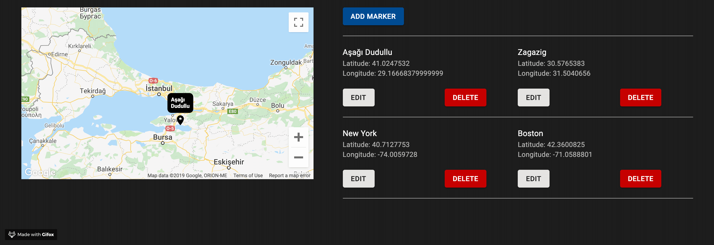
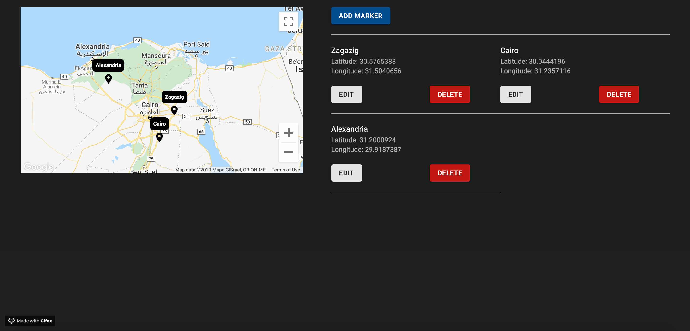

# Maps Markers client
React application that shows a map and markers on it.
## Concept
A user should be able to view, create, edit and delete this markers.
All the changes should be immediately visible on the map.

  

## Run The APP

#### Node is Needed
[Node.js](https://nodejs.org/en/)

#### Dependency manager
install `yarn` package manager globally
[Yarn](https://yarnpkg.com/lang/en/docs/install/)

#### Recommended IDE
[VSCode](https://code.visualstudio.com/)

#### Install `eslint` to follow code quality
[Eslint](https://marketplace.visualstudio.com/items?itemName=dbaeumer.vscode-eslint)

### Clone the Repo
clone the repo `git clone git@github.com:runesam/maps-markers-client.git`

then navigate to the project root dir `cd maps-markers-client`

### client
- install dependencies via `yarn`
- init the client server via `yarn serve`
  - default client server port is `8181` please make sure it is available.
  
## tasks
<b><i>
*   please make sure the app server's client side is up and running as the app tries to fetch user data on start `google api key` and `pre saved markers`
*   the default API_URL is set to `http://localhost:5000` in the `.env` file. if the API server will run on different port; we need to update it here as well.
</i></b>

#### serve (run the app locally via webpack-dev-server)
* test `yarn serve`

#### test (unit test with coverage report)
* test `yarn test`
* test watch `yarn test:watch`
#### flow (data type checker)
* flow `yarn flow`
* flow watch `yarn flow:watch`
#### build (bundle app to /dist dir)
* build `yarn build`

## app flow
#### Add markers

  

#### Delete markers

  

#### Update markers

  

## Find in the App

### client
- React
- material UI
- jest
- flow
- eslint (air bnb preset)

## TODO
### code base
- app is only designed for desktop. responsive to be implemented.
- integration test.
- better error handlers.
